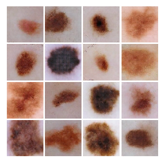
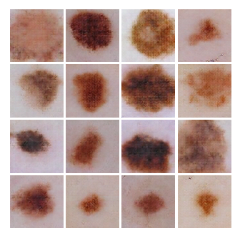
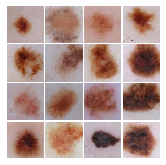

# ASIC GAN
In this exercise we have to create a GAN that generates images of melanoma similar
to [isic-archive](https://isic-archive.com).

This repository contains a the GAN and a tool to download, resize and augment images from the isic-archive.

# GAN
The GAN can be trained on different training image sets. The best results where produced using 10000 images of 160x160 pixels that have been generated by data augmentation out of 55 hand picked isic-archive images.

Unpack the training images

    tar xf training_set/training_images_160x160_augmented_10k.tar.bz2

Train the GAN for 200000 epochs with a batch size of 16, writing results to ./output

    python GAN.py training_images_160x160_augmented_10k 200000 16 output

On an Tesla P100-PCIE-12GB the network needs about 17 hours to train, and will generate multiple intermediate output images.

Example1 | Example 2  | Example 3
:-------------:|:------------:|:-------------:
  |   |   |

# ETL of test images
In order to download and preprocess images of the data-set I created a tool
`isic_dataset.py`.

Try
    python isic_dataset.py --help

## Download Images
One can download multiple images from the different data sets offered by isic

    python isic_dataset.py download --help

Example Download 1000 images to the folder original_images

    python isic_dataset.py download ./original_images -n 1000

*Note* Based on the content of the isic-archive fewer pictures might be downloaded
than specified.

## Transform Images
The original images exist in different resolutions and sizes. In order to use them
for training they have to be reshaped to the same size. This is done by center
cropping and resizing.

    python isic_dataset.py transform --help

Example: Transform all images in ./original_images to a size of 100x100 and store them in the folder ./test_images

    python isic_dataset.py transform ./original_images ./test_images 100 100

## Data Augmentation
Training images can be augmented using the [Augmentor](https://github.com/mdbloice/Augmentor) library.

    python isic_dataset.py augment --help

Example: Augment images in *training_images*, generating 10000 augmented images

    python isic_dataset.py augment training_images 10000

The augmented images are stored in *training_images/output*